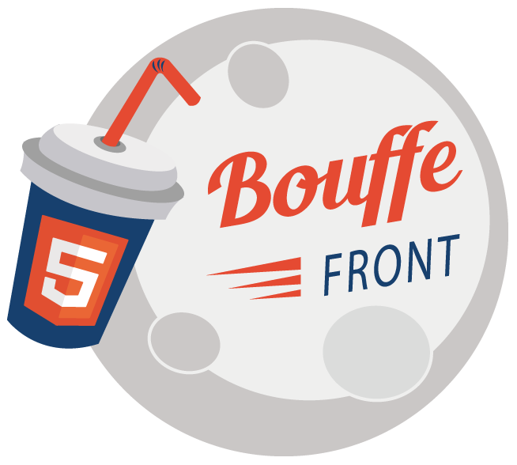

# Bouffe Front 

## Proposer un sujet

Ajouter une issue avec le tag "Proposition" avec une description et le temps de votre talk.

## Demander un sujet

Identique à la proposition mais avec le tag "Demande".

Enjoy !

## Le site web

Pour garder une trace des présentations faites, les bouffes front ont un site !

C'est un site statique généré à l'aide de [Jekyll](https://jekyllrb.com/).

Les pré-requis : avoir ruby installé et ensuite installer Jekyll (cf la doc).

### Pour les speakers

- Créer une nouvelle branche 
- Ajouter dans `_posts/` un fichier markdown `[YYYY]-[MM]-[DD]-[TITRE_DE_LA_PREZ].md` qui contiendra un lien vers vos slides et un résumé. 
- Créer une pull request pour, qu'une fois mergé, votre prez soit visible sur le site :)

